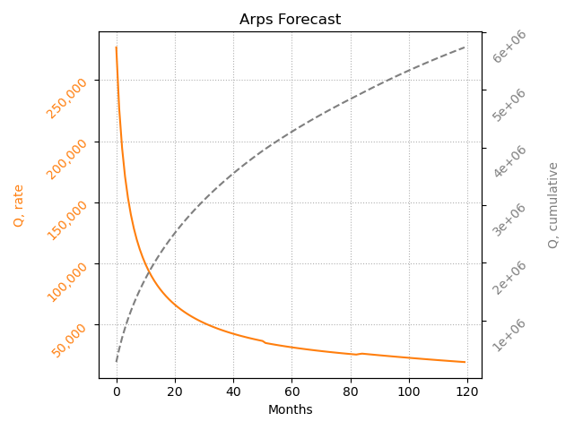

# Arps

Python3 implementation of the J.J. Arps equation, commonly used for decline curve analysis.

User inputs include:
- `Qi`: initial production, bbl/day or scf/day
- `D`: D_esi, initial effective decline rate from secant approximation, 1/year
- `B`: hyperbolic exponent           
- `dlim`: limiting effective decline rate, below/after which an exponential decline is used, 1/year
- `years`: number of years to forecast

Implementations of both rate-time and cumulative rate Arps are included.

# Example

|   | 
|:--:| 
| Parameters = {Qi = 10000, D = .7, B = 1.4, dlim = .1, years = 10} |

# Referenced Links
- https://secure.spee.org/sites/spee.org/files/wp-files/pdf/ReferencesResources/REP06-DeclineCurves.pdf
- http://www.fekete.com/san/webhelp/feketeharmony/harmony_webhelp/content/html_files/reference_material/analysis_method_theory/Traditional_Decline_Theory.htm
- https://petrowiki.org/Production_forecasting_decline_curve_analysis
